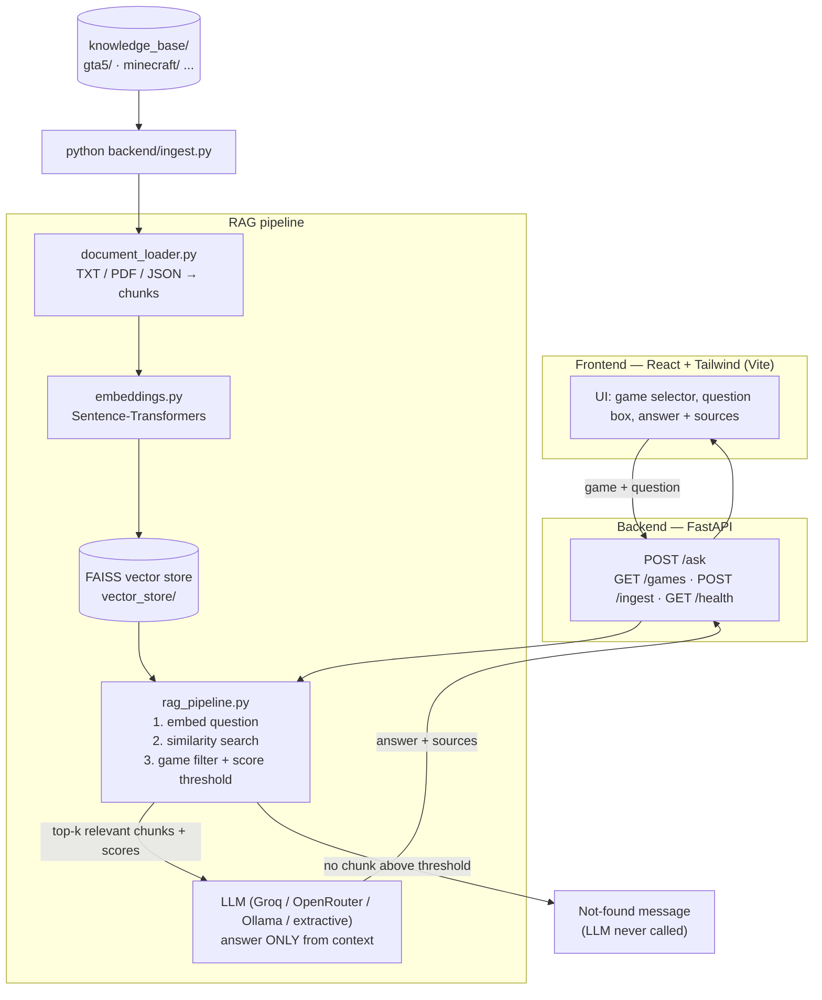

# 🎮 GameWiki AI

**An open-source, RAG-based game knowledge assistant.**

Pick a game, ask a question — *"How do I complete The Jewel Store Job?"* — and GameWiki AI
retrieves the relevant sections of **your own** game knowledge base and uses an LLM to
generate a grounded answer, complete with sources.

If the knowledge base doesn't contain the answer, it says so instead of making things up:

> *"I couldn't find reliable information about this in the current game knowledge base."*

---

## 1. What is RAG?

**RAG = Retrieval-Augmented Generation.**

Instead of asking an LLM to answer from memory (where it can hallucinate game facts),
we first **retrieve** the most relevant passages from a knowledge base we control, then
**generate** an answer using *only* those passages.

| | Plain LLM | RAG |
|---|---|---|
| Knowledge source | Model training data (may be outdated/wrong) | Your documents |
| Hallucinations | Common | Strongly controlled by the relevance threshold + prompt |
| Sources shown | ❌ | ✅ Every answer cites its files |
| Adding new games | Impossible | Drop a folder + re-run ingestion |

---

## 2. Architecture



**Retrieval and generation are strictly separated**: `retrieve()` only does math and
filtering, `generate()` only builds the prompt and calls the LLM.

---

## 3. Technology stack

| Layer | Tech |
|---|---|
| Frontend | React 18, Tailwind CSS 4, Vite |
| Backend | Python, FastAPI, Uvicorn |
| RAG | LangChain (document loading, splitting, FAISS wrapper) |
| Embeddings | Sentence-Transformers (`all-MiniLM-L6-v2`, local & free) |
| Vector DB | FAISS (CPU, local file, free) |
| LLM | Any OpenAI-compatible API (Groq free tier by default), Ollama, or offline extractive mode |
| Data | TXT, PDF, JSON |

---

## 4. Project structure

```
GameWiki-AI/
│
├── backend/
│   ├── main.py              # FastAPI app: /games, /ask, /ingest, /health
│   ├── rag_pipeline.py      # retrieval + generation + LLM config
│   ├── document_loader.py   # TXT/PDF/JSON → cleaned chunks + metadata
│   ├── embeddings.py        # Sentence-Transformers wrapper (LangChain-compatible)
│   ├── ingest.py            # python backend/ingest.py → builds the FAISS index
│   └── requirements.txt
│
├── frontend/
│   ├── src/
│   │   ├── App.jsx          # main UI: selector, question, chat history
│   │   ├── components/Message.jsx   # answer card + sources
│   │   ├── api.js           # fetch helpers
│   │   ├── data/examples.js # example questions per game
│   │   ├── index.css        # Tailwind + gaming styles
│   │   └── main.jsx
│   ├── index.html
│   ├── vite.config.js       # React + Tailwind + /api proxy
│   └── package.json
│
├── knowledge_base/          # ← put your game documents here
│   ├── gta5/                #    (folder name = game id)
│   │   ├── missions.txt · mission_guides.txt · heists.txt
│   │   ├── characters.txt · story.txt · wanted_level.txt
│   │   ├── weapons.txt · vehicles.txt · locations.txt
│   │   ├── businesses.txt · activities.txt
│   │   └── gameplay_mechanics.txt
│   ├── minecraft/            # 17 files — crafting, tools, armor, mining,
│   │   ├── mobs.txt · biomes.txt · structures.txt
│   │   ├── villagers.txt · farming.txt · enchanting.txt
│   │   ├── potions.txt · redstone.txt · transportation.txt
│   │   ├── items.txt · dimensions.txt · progression.txt
│   │   └── mechanics.txt · crafting.txt · mining.txt · tools_weapons.txt · armor.txt
│   └── forza_horizon_6/      # 20 files — overview, progression, campaign,
│       ├── overview.txt · progression.txt · campaign.txt
│       ├── cars.txt · car_classes.txt · car_recommendations.txt
│       ├── tuning.txt · upgrades.txt · races.txt
│       ├── locations.txt · japan_map.txt · multiplayer.txt
│       ├── car_meets.txt · eventlab.txt · houses_and_garages.txt
│       ├── festival_playlist.txt · rewards.txt
│       └── gameplay_mechanics.txt · accessibility.txt · how_to_guides.txt
│
├── vector_store/            # generated FAISS index (git-ignored)
├── .env.example             # configuration template
├── .gitignore
└── README.md
```

---

## 5. How the RAG pipeline works

1. **Ingestion (offline)** — `python backend/ingest.py`
   - scans `knowledge_base/<game>/<file>` for `.txt`, `.pdf`, `.json`
   - cleans the text (normalize newlines, collapse blank lines)
   - splits it into ~900-char chunks with 150-char overlap (LangChain `RecursiveCharacterTextSplitter`)
   - PDFs are loaded **page by page** so page numbers are kept
   - every chunk is stored with metadata: `game`, `source`, `doc_type`, `page`, `title`
   - chunks are embedded with Sentence-Transformers (**L2-normalized** vectors)
   - the FAISS index is written to `vector_store/` plus an `index_info.json` manifest
2. **Question time (online)** — `POST /ask {game, question}`
   - the question is embedded with the *same* model
   - FAISS similarity search returns the nearest chunks (squared L2 distance)
   - distance is converted to **cosine similarity** (`cos = 1 - d/2` for unit vectors)
   - chunks from **other games are dropped** (game filtering)
   - chunks below `RETRIEVAL_MIN_SCORE` (default **0.30**) are dropped (relevance gate)
   - if **nothing survives → the standard not-found message is returned and the LLM is never called**
   - the survivors are **re-ordered with an IDF-weighted lexical bonus**
     (`RETRIEVAL_LEXICAL_WEIGHT`, default 0.45) that favours chunks covering the
     question's distinctive words and section headings — this is what makes
     different phrasings ("5-star" vs "lose the cops", "recipe for a torch" vs
     "how do I craft a torch") land on the right section. It only re-orders
     chunks that already passed the relevance gate; the gate itself always uses
     the raw cosine score, so hallucination protection is unchanged
   - otherwise the top `RETRIEVAL_TOP_K` (default 4) chunks become the context
3. **Generation**
   - the LLM receives a strict system prompt: answer *only* from the context, never invent
   - temperature is `0.0` for factual, deterministic answers
   - the response returns with deduplicated sources (`file`, `page`, `title`, `sections`)

---

## 6. Installation

Prerequisites: **Python 3.10+**, **Node.js 18+**.

```bash
git clone https://github.com/<your-username>/GameWiki-AI.git
cd GameWiki-AI

# Backend
python -m venv .venv
source .venv/bin/activate          # Windows: .venv\Scripts\activate
pip install -r backend/requirements.txt

# Frontend
cd frontend && npm install && cd ..

# Configuration
cp .env.example .env               # then add your LLM API key (see section 10)
```

The first ingestion downloads the embedding model (~90 MB) once; it is cached afterwards.

---

## 7. Adding game documents

Drop files into a **sub-folder of `knowledge_base/`** — the folder name becomes the game id:

```
knowledge_base/
└── elden_ring/
    ├── bosses.txt        # any .txt
    ├── weapons.pdf       # any .pdf (page numbers preserved)
    └── items.json        # any .json (flattened to searchable key/value text)
```

* Plain text files work best with a Markdown-ish structure: `# Title` on the first line
  and `=== Section ===` headings per topic — those headings are shown in the sources.
* **No code changes needed** — the loader, index and UI all discover games automatically.
* Then re-run ingestion (step 8). Done.

---

## 8. Running ingestion

```bash
python backend/ingest.py
```

or from another terminal while the backend runs:

```bash
curl -X POST http://localhost:8000/ingest
```

Re-run it **whenever you add, edit or delete documents**. The index is rebuilt from
scratch each time, so stale chunks never linger. Embeddings are **never** recomputed
while a user asks a question.

---

## 9. Starting the app

Terminal 1 — backend:

```bash
uvicorn backend.main:app --reload --port 8000
```

Terminal 2 — frontend:

```bash
npm run dev          # from frontend/
```

Open **http://localhost:5173** — the Vite dev server proxies `/api` → `localhost:8000`.
Each game keeps its **own chat history** — switching the game selector shows that
game's conversation (or a fresh empty one), and *Clear chat* empties only the
currently selected game.

### Tests

```bash
python backend/test_pipeline.py        # RAG pipeline + guardrail checks
python backend/test_questions.py       # end-to-end question suite (live LLM)
python backend/test_questions.py --extractive   # offline retrieval-only run
npm test                               # per-game chat state (from frontend/)
node tests/ui_e2e.mjs                  # browser E2E of chat separation
                                       # (needs dev servers + headless Chrome)

### API endpoints

| Method | Path | Body / params | Returns |
|---|---|---|---|
| GET | `/health` | — | index status, LLM config |
| GET | `/games` | — | `[{id, name, files, ingested}]` |
| POST | `/ask` | `{"game": "gta5", "question": "..."}` | `{answer, sources, found, ...}` |
| POST | `/ingest` | — | ingestion report |

```json
POST /ask
{
  "game": "gta5",
  "question": "How do I complete The Jewel Store Job?"
}

→
{
  "answer": "The Jewel Store Job is the first heist in GTA 5 ...",
  "sources": [
    { "file": "missions.txt", "page": null, "title": "GTA 5 — Mission Guide",
      "sections": ["The Jewel Store Job"] }
  ],
  "found": true,
  "retrieved_chunks": 3
}
```

---

## 10. Configuring the LLM

All configuration lives in `.env` (copy it from `.env.example`). **Never hard-code keys.**

| Variable | Meaning |
|---|---|
| `LLM_PROVIDER` | `openai` (default, any OpenAI-compatible API) · `ollama` (local) · `extractive` (offline) |
| `LLM_API_KEY` | your API key — free tier available at [console.groq.com](https://console.groq.com) |
| `LLM_MODEL` | e.g. `llama-3.3-70b-versatile` (Groq), `gpt-4o-mini` (OpenAI), `llama3.2` (Ollama) |
| `LLM_API_BASE` | optional base URL override, e.g. `https://openrouter.ai/api/v1` |
| `RETRIEVAL_MIN_SCORE` | cosine threshold 0–1, default `0.30` (raise to be stricter) |
| `RETRIEVAL_TOP_K` | how many chunks are passed to the LLM, default `4` |
| `RETRIEVAL_LEXICAL_WEIGHT` | strength of the phrasing/section re-ranking bonus, default `0.45` (`0` = pure embedding ranking) |
| `EMBEDDING_MODEL` | default `sentence-transformers/all-MiniLM-L6-v2` |

**Free options:**
* **Groq** (default): free API keys, very fast — set `LLM_API_KEY`.
* **Ollama**: run a local model, no key — `LLM_PROVIDER=ollama`.
* **Extractive mode**: fully offline, no key — answers by **quoting the retrieved chunk
  verbatim** (`LLM_PROVIDER=extractive`). Great for testing retrieval end-to-end.
* **No key yet?** The app still works: with an empty `LLM_API_KEY` the backend
  automatically answers in offline extractive mode, and the answer itself explains
  how to upgrade. Bad keys or network failures return a clear HTTP 503 error.

---

## 11. Example questions

**GTA 5**
* How do I complete The Jewel Store Job?
* Who is Michael?
* What weapons are available?
* Where is the Vangelico jewelry store?

**Minecraft**
* How do I craft a diamond pickaxe?
* How do I defeat the Ender Dragon?
* What do creepers drop?
* How do I get netherite?

**Forza Horizon 6**
* How do I unlock Legend Island?
* What are Wristbands?
* What is the best drift car?
* What are Touge Battles?

**Try the guardrail too** (should return the not-found message):
* *Who is the president of France?* → nothing in the knowledge base is remotely about
  that, every chunk scores below the relevance threshold, so no answer is generated.
* *In GTA 5, how do I catch a Pokémon?* → no relevant chunks, same result.

---

## 12. Hallucination prevention

Four layers keep the assistant honest:

1. **Relevance threshold** — chunks under `RETRIEVAL_MIN_SCORE` never reach the LLM;
   zero survivors ⇒ the pipeline returns the not-found message *without calling the LLM*.
2. **Strict system prompt** — *"Answer using ONLY the supplied context … Do not invent
   mission steps, item statistics, locations, characters…"* with `temperature = 0`.
3. **Game isolation** — retrieval drops chunks from other games, so GTA 5 questions can
   never pull Minecraft text.
4. **Extractive fallback mode** — with `LLM_PROVIDER=extractive`, the "answer" is a
   verbatim quote of the retrieved chunk: it is impossible to invent by construction.

---

## 13. Adding another game

1. `mkdir knowledge_base/starfield`
2. Add your TXT/PDF/JSON files inside.
3. `python backend/ingest.py`
4. Start the app — the game appears in the dropdown automatically.

(Optionally add a display-name override in `GAME_NAME_OVERRIDES` in
`backend/document_loader.py` — otherwise `starfield` becomes "Starfield".)

---

## 14. GitHub setup

```bash
git init
git add .
git commit -m "GameWiki AI: RAG-based game knowledge assistant"
git branch -M main
git remote add origin https://github.com/<your-username>/GameWiki-AI.git
git push -u origin main
```

`.env` and `vector_store/` contents are git-ignored — only `.env.example` is committed.

---

## 15. Troubleshooting

| Symptom | Fix |
|---|---|
| *"Vector index not built"* | run `python backend/ingest.py` |
| *"No LLM_API_KEY is configured"* (in the answer) | copy `.env.example` → `.env`, add your key, restart the backend — until then the app answers in offline extractive mode |
| *"Cannot reach the backend"* | start uvicorn on port 8000 |
| 404s from the frontend | Vite proxy must forward `/api` (see `vite.config.js`) |
| Answers feel too strict/loose | tune `RETRIEVAL_MIN_SCORE` (higher = stricter) |
| New files ignored | re-run ingestion after adding files |
